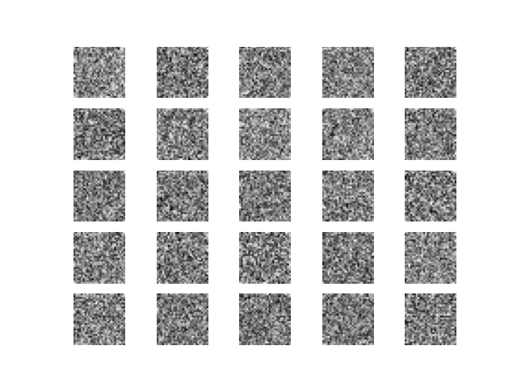
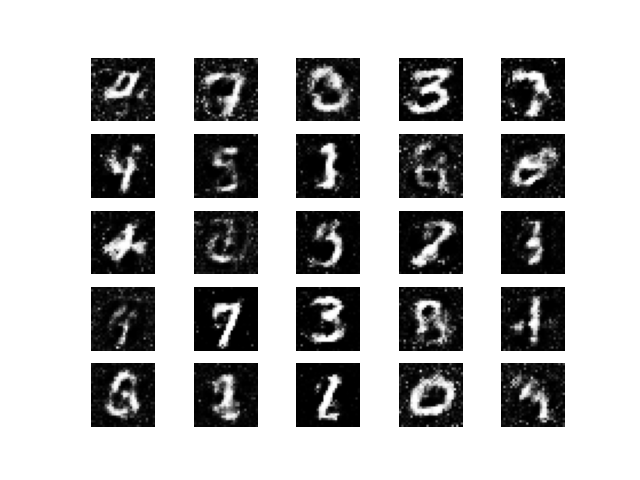
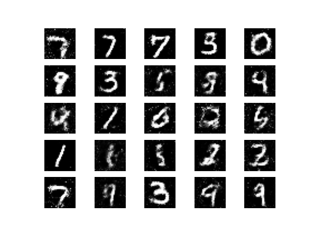
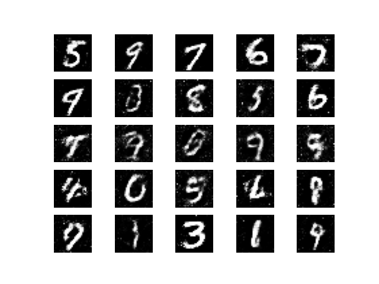
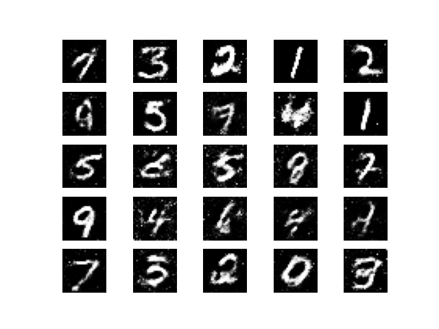
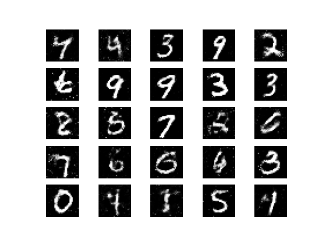

# Problem understanding

The goal of this project is to understang the powerful of Generative Adversarial Network (GAN).

In general, Deep Learning models can be divided into generative models and discriminant models. In the perspective of the probability and statistical theory, a discriminant model is a method of modeling the relationship between unknown data y and known data x, whereas a generative model refers to a model that can randomly generate observations under the condition of given some implicit parameters.

Deep Learning is data hungry and needs a large dataset to work well. In the face of the lack of the data, several techniques are used to increase the training dataset size. In the case of images, we have Image Data Augmentation that is a technique that uses geometric transformations: Flipping, cropping, zoom, etc.

This technique is somehow limited. GAN is a new ML approach for image generating. GAN consists of generating realistic images based on the real ones.

GAN contains two networks (Generator and Discriminator) that play a mini-max game.

In this project, we generated images by using GAN on MNIST digit dataset.

# Install Project
```bash
$ git clone https://github.com/Mikhael-P/Generative-Adversarial-Network-GAN-.git
```
```bash
$ cd Generative-Adversarial-Network-GAN-
```

# Virtual environment

## Mac OS

### Create a virtual environment

```bash
$ python3 -m venv ENV_NAME
```
### Activate your environment
```bash
$ source ENV_NAME/bin/activate
```

## Linux OS

### Create a virtual environment

```bash
$ conda create -n venv ENV_NAME
```
### Activate your environment
```bash
$ activate ENV_NAME
```

# Requirement installations

To run this project, make sure to install all the requirements by the code below:

```bash
$ pip install -r requirement.txt
```

# Running the model

```bash
$ python3 main.py
```

# Results

#### At the beginin of the training


#### Epoch = 3k


#### Epoch = 6k


#### Epoch = 9k


#### Epoch = 12k


#### Epoch = 14k
